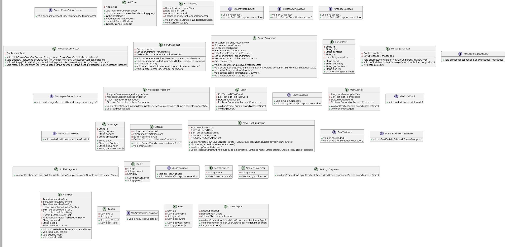
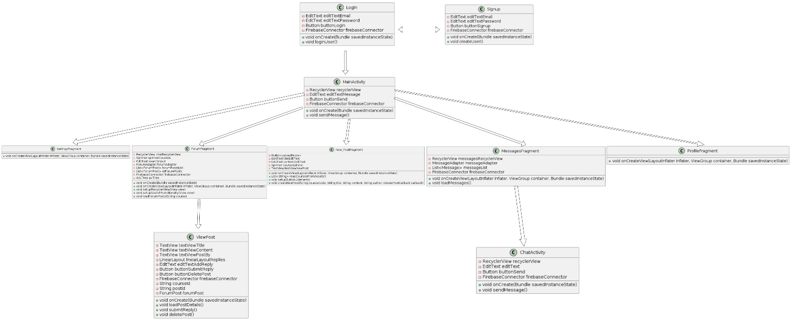

# [G64 - Team Name] Report

## Table of Contents

1. [Team Members and Roles](#team-members-and-roles)
2. [Summary of Individual Contributions](#summary-of-individual-contributions)
3. [Application Description](#application-description)
4. [Application UML](#application-uml)
5. [Application Design and Decisions](#application-design-and-decisions)
6. [Summary of Known Errors and Bugs](#summary-of-known-errors-and-bugs)
7. [Testing Summary](#testing-summary)
8. [Implemented Features](#implemented-features)
9. [Team Meetings](#team-meetings)
10. [Conflict Resolution Protocol](#conflict-resolution-protocol)

## Administrative
- Firebase Repository Link: <insert-link-to-firebase-repository>
   - Confirm: I have already added comp21006442@gmail.com as a Developer to the Firebase project prior to due date.
- Two user accounts for markers' access are usable on the app's APK (do not change the username and password unless there are exceptional circumstances. Note that they are not real e-mail addresses in use):
   - Username: comp2100@anu.edu.au	Password: comp2100
   - Username: comp6442@anu.edu.au	Password: comp6442

## Team Members and Roles

| UID        |      Name      |                           Role |
|:-----------|:--------------:|-------------------------------:|
| [u7693841] | [Zekun An]     |                     [Back-end] |
| [u7633136] | [Cheng Cui]    |                     [Back-end] |
| [u7735537] | [Madhav Krishnan] | [Back-end / Front-end / Cloud] |
| [u7721335] | [Kechun Ma]    |                     [Back-end] |
| [u7780416] | [Ziying Zhang] |                     [Back-end] |

## Summary of Individual Contributions

1. ### **UID1: u7693841, Name1: Zekun An** 
I have a 20% contribution, as follows:

   - **Code Contribution in the Final App**
      - **Data Handling and Management**
      - **Datafiles**: Structured and managed data files essential for the app's backend. This task involved defining data formats and ensuring compatibility across different application modules.(https://gitlab.cecs.anu.edu.au/u7693841/gp-24s1/-/blob/Kun/Forum/app/src/main/assets/db.json?ref_type=heads)
      
      - **Login Functionality**: Developed the login feature, ensuring secure user authentication and session management using best security practices.[Class Login](https://gitlab.cecs.anu.edu.au/u7693841/gp-24s1/-/blob/main/App/app/src/main/java/com/example/mackenz/Login.java?ref_type=heads)
      
      - **Design Patterns**
      
      - **Model-View-Controller (MVC) Design Pattern**: Proposed and implemented the MVC pattern to segregate the application into logical components, facilitating easier maintenance and scalability.

   - **Code and App Design**
      - **Design Patterns and Data Structures**: Suggested using the MVC design pattern to organize the codebase efficiently, enhancing the team's ability to manage and extend the application's features.
      - **UI Design Contribution**: Actively participated in UI layout discussions, provided feedback to improve user interaction based on the principles of user-centered design.

   - **Others**
      - **Documentation and Version Control**: Regularly updated documentation and maintained clear and comprehensive commit logs in the Git repository to support project tracking and collaboration.
          

2. ### **UID2: u7633136, Name2: Cheng Cui**
I have a 20% contribution, as follows:

   - **Code Contribution in the Final App**
      - **Data Handling and Management**
      - **Load and Show Data**: Developed functionalities to load and display data from various sources efficiently, enhancing the user's ability to interact with vast amounts of educational content.
      [Class ForumAdapter, method onBindViewHolder](https://gitlab.cecs.anu.edu.au/u7693841/gp-24s1/-/blame/main/App/app/src/main/java/com/example/mackenz/ForumAdapter.java#L27-39)
      [Class ForumFragment, method setupRecyclerView](https://gitlab.cecs.anu.edu.au/u7693841/gp-24s1/-/blame/main/App/app/src/main/java/com/example/mackenz/ForumFragment.java#L102-121)
      [Class ForumFragment, method loadForumPosts](https://gitlab.cecs.anu.edu.au/u7693841/gp-24s1/-/blame/main/App/app/src/main/java/com/example/mackenz/ForumFragment.java#L146-165)
      [Class ViewPost, method loadPostDetails](https://gitlab.cecs.anu.edu.au/u7693841/gp-24s1/-/blame/main/App/app/src/main/java/com/example/mackenz/ViewPost.java#L82-107)

     - **Data Formats**: Defined and implemented robust data format standards that facilitate seamless data integration and manipulation across different modules of the application.
      [Class ForumFragment, method getCurrentUsernamer](https://gitlab.cecs.anu.edu.au/u7693841/gp-24s1/-/blob/main/App/app/src/main/java/com/example/mackenz/ForumFragment.java#L123-128)
      [Class ForumFragment, method loadForumPosts](https://gitlab.cecs.anu.edu.au/u7693841/gp-24s1/-/blob/main/App/app/src/main/java/com/example/mackenz/ForumFragment.java#L146-165)
      [Class New_PostFragment, method readCoursesFromAssets](https://gitlab.cecs.anu.edu.au/u7693841/gp-24s1/-/blob/main/App/app/src/main/java/com/example/mackenz/New_PostFragment.java#L63-78)
      [Class ViewPost, method getCurrentUsername](https://gitlab.cecs.anu.edu.au/u7693841/gp-24s1/-/blob/main/App/app/src/main/java/com/example/mackenz/ViewPost.java#L152-159)
      [Class ViewPost, method readAdminCourses](https://gitlab.cecs.anu.edu.au/u7693841/gp-24s1/-/blob/main/App/app/src/main/java/com/example/mackenz/ViewPost.java#L176-193)

      - **Privacy-Visibility**: Introduced administrative controls to edit or delete posts, enhancing moderation capabilities while maintaining privacy and content integrity..
      [Class ViewPost, method onCreate](https://gitlab.cecs.anu.edu.au/u7693841/gp-24s1/-/blob/main/App/app/src/main/java/com/example/mackenz/ViewPost.java#L67-80)
      [Class ViewPost, method checkIfAdmin](https://gitlab.cecs.anu.edu.au/u7693841/gp-24s1/-/blob/main/App/app/src/main/java/com/example/mackenz/ViewPost.java#L161-174)
      [Class ViewPost, method readAdminCourses](https://gitlab.cecs.anu.edu.au/u7693841/gp-24s1/-/blame/main/App/app/src/main/java/com/example/mackenz/ViewPost.java#L178-193)

   - **Code and App Design**
      - **Design Patterns and Data Structures**: Advocated for the use of advanced data structures to optimize data storage and retrieval processes, significantly enhancing application performance.
      - **UI Design Contribution**: Contributed to the design decisions focusing on data presentation and visualization, ensuring that information is presented in a clear, accessible, and visually appealing manner.

   - **Others**
   - **Documentation and Version Control**: Played a key role in maintaining comprehensive documentation and version control, ensuring that updates and changes were accurately recorded and communicated to all team members.

3. ### **U7735537, Madhav Krishnan**
I have 20% contribution, as follows:
-  **Code Contribution in the final App**
- Feature [Data-Profile] [ProfileFragment.java](https://gitlab.cecs.anu.edu.au/u7693841/gp-24s1/-/blob/17b36aa70480e6e6e9abb75be59ad3bcd3c9a0cc/App/app/src/main/java/com/example/mackenz/ProfileFragment.java) I implemented the user profiles, they show the 4 courses and a different images for each user when loading, the images are accessed from the drawable content locally
- Feature [FB-Auth] [loginWithFirebase](https://gitlab.cecs.anu.edu.au/u7693841/gp-24s1/-/blob/17b36aa70480e6e6e9abb75be59ad3bcd3c9a0cc/App/app/src/main/java/com/example/mackenz/Login.java#L89-117)  [loginUser, createNewUser](https://gitlab.cecs.anu.edu.au/u7693841/gp-24s1/-/blob/17b36aa70480e6e6e9abb75be59ad3bcd3c9a0cc/App/app/src/main/java/com/example/mackenz/FirebaseConnector.java#L35-74) [updateUserPassword](https://gitlab.cecs.anu.edu.au/u7693841/gp-24s1/-/blob/17b36aa70480e6e6e9abb75be59ad3bcd3c9a0cc/App/app/src/main/java/com/example/mackenz/FirebaseConnector.java#89-95)
  I implemented the authentication with the help of firebase, it ensures new users can be created without the same username and
- Feature [FB-Persist-extension] [loadMessages, addReplyToPost, fetchPostDetailsWithRealTimeUpdates, fetchForumPostsForCourse](https://gitlab.cecs.anu.edu.au/u7693841/gp-24s1/-/blob/17b36aa70480e6e6e9abb75be59ad3bcd3c9a0cc/App/app/src/main/java/com/example/mackenz/FirebaseConnector.java#L191-310)
- Feature [P2P-DM] [Chatactivity.java](https://gitlab.cecs.anu.edu.au/u7693841/gp-24s1/-/blob/17b36aa70480e6e6e9abb75be59ad3bcd3c9a0cc/App/app/src/main/java/com/example/mackenz/ChatActivity.java) [MessagesFragment.java](https://gitlab.cecs.anu.edu.au/u7693841/gp-24s1/-/blob/17b36aa70480e6e6e9abb75be59ad3bcd3c9a0cc/App/app/src/main/java/com/example/mackenz/MessagesFragment.java)
- Feature [P2P-Block] [blockuser](https://gitlab.cecs.anu.edu.au/u7693841/gp-24s1/-/blob/17b36aa70480e6e6e9abb75be59ad3bcd3c9a0cc/App/app/src/main/java/com/example/mackenz/ProfileFragment.java#L209-218) This just adds the blocked user in userpref as blocked but doesnt disable messages.
- Feature [P2P-Restriction] [ProfileFragment.java onclicklisteners](https://gitlab.cecs.anu.edu.au/u7693841/gp-24s1/-/blob/17b36aa70480e6e6e9abb75be59ad3bcd3c9a0cc/App/app/src/main/java/com/example/mackenz/ProfileFragment.java#L100-128) Normal users aren't allowed to message admins(defined as COMP2100, COMP6643) and it will display a toast saying its not available
  Design Patterns
- Singleton -  The firebase instance is a singleton pattern since its initialised in firebaseconnector and used everywhere
- Observer - This can be seen in the use of Firebase Realtime Database listeners.
  Subject: Firebase Database references.
  Observers: Event listeners such as ValueEventListener in the FirebaseConnector class.
- Factory : This can be seen in the use of static factory methods in fragment classes
- **Code and App Design**
- I proposed the design patterns did the whole firebase structure
- UI I did all the UI in [res folder](https://gitlab.cecs.anu.edu.au/u7693841/gp-24s1/-/tree/17b36aa70480e6e6e9abb75be59ad3bcd3c9a0cc/App/app/src/main/res) including making the app logo, using different images for send button in messages and profiles, it should be noted that this UI was built from scratch but was inspired by UI made by Zekun and Cheng in the old version of the app which can be found in main branch commits.   

4. ### **UID4: u7721335, Name4: Kechun Ma**
I have a 20% contribution, as follows:

   - **Code Contribution in the Final App**
      - **Search Filter**: Developed advanced filtering mechanisms that allow users to effectively narrow down search results based on specific criteria, enhancing the user's ability to find relevant educational content quickly.
      - [Class ForumFragment, method onCreateView](https://gitlab.cecs.anu.edu.au/u7693841/gp-24s1/-/blob/main/App/app/src/main/java/com/example/mackenz/ForumFragment.java#L66-L100)

       - **Data Deletion**: Implemented secure and efficient data deletion functionalities, ensuring that users can manage their data privacy and storage needs effectively.
       - [Class AVLTree, method delete](https://gitlab.cecs.anu.edu.au/u7693841/gp-24s1/-/blob/4b9a26f19df11c34855c6d282eec003e49892f54/App/app/src/main/java/com/example/mackenz/AVLTree.java#L171-L173)
       - [Class AVLTree, method deleteNode](https://gitlab.cecs.anu.edu.au/u7693841/gp-24s1/-/blob/4b9a26f19df11c34855c6d282eec003e49892f54/App/app/src/main/java/com/example/mackenz/AVLTree.java#L175-L198)
       - [Class AVLTree, method minValueNode](https://gitlab.cecs.anu.edu.au/u7693841/gp-24s1/-/blob/4b9a26f19df11c34855c6d282eec003e49892f54/App/app/src/main/java/com/example/mackenz/AVLTree.java#L200-L206)
       - [Class ViewPost, method deletePost](https://gitlab.cecs.anu.edu.au/u7693841/gp-24s1/-/blob/main/App/app/src/main/java/com/example/mackenz/ViewPost.java#L134-L144)

   - **Code and App Design**
      - **Design Patterns and Data Structures**: Utilized sophisticated data structures to optimize the search and filter processes, ensuring high performance and responsiveness of these features.
      - **UI Design Contribution**: 
      - [activity_comment.xml](https://gitlab.cecs.anu.edu.au/u7693841/gp-24s1/-/blob/UIupload/Forum/app/src/main/res/layout/activity_comment.xml?ref_type=heads), [activity_forum_add.xml](https://gitlab.cecs.anu.edu.au/u7693841/gp-24s1/-/blob/UIupload/Forum/app/src/main/res/layout/activity_forum_add.xml?ref_type=heads), [activity_forum_detail.xml](https://gitlab.cecs.anu.edu.au/u7693841/gp-24s1/-/blob/UIupload/Forum/app/src/main/res/layout/activity_forum_detail.xml?ref_type=heads)
      - Assisted in designing interactive elements for the search and filter features, ensuring that these functionalities are both accessible and intuitive for users.

   - **Others**
   - **Documentation and Version Control**: Played a crucial role in maintaining up-to-date documentation and version control, focusing particularly on features related to data management and user interaction capabilities.

  
5. ### **UID5: u7780416, Name5: Ziying Zhang**
I have a 20% contribution, as follows:

   - **Code Contribution in the Final App**
      - **Search**: Developed the core search functionality that allows users to query the database effectively, enabling them to find educational content swiftly and accurately.
      [Class AVLTree](https://gitlab.cecs.anu.edu.au/u7693841/gp-24s1/-/blob/main/App/app/src/main/java/com/example/mackenz/AVLTree.java#L1-217)
      [Class SearchParser](https://gitlab.cecs.anu.edu.au/u7693841/gp-24s1/-/blob/main/App/app/src/main/java/com/example/mackenz/SearchParser.java#L1-54)
      [Class SearchTokenizer](https://gitlab.cecs.anu.edu.au/u7693841/gp-24s1/-/blob/main/App/app/src/main/java/com/example/mackenz/SearchTokenizer.java#L1-84)
      [Class Token](https://gitlab.cecs.anu.edu.au/u7693841/gp-24s1/-/blob/main/App/app/src/main/java/com/example/mackenz/Token.java#L1-62)
      [Class ForumFragment](https://gitlab.cecs.anu.edu.au/u7693841/gp-24s1/-/blob/main/App/app/src/main/java/com/example/mackenz/ForumFragment.java#L167-220)
      - **Search Invalid**: Implemented robust error handling and validation for search queries, enhancing the app's reliability and user experience by providing clear feedback on invalid search inputs.
      [Class ForumFragment](https://gitlab.cecs.anu.edu.au/u7693841/gp-24s1/-/blob/main/App/app/src/main/java/com/example/mackenz/ForumFragment.java#L233-267)

   - **Code and App Design**
      - **Design Patterns and Data Structures**: Advocated for and implemented efficient algorithms and data structures to optimize search responsiveness and accuracy.
      - **UI Design Contribution**: Contributed to the UI design, particularly in integrating search functionality seamlessly into the overall layout, ensuring a smooth and intuitive user interaction.

   - **Others**
   - **Documentation and Version Control**: Diligently maintained comprehensive documentation and version control, focusing especially on features related to search capabilities and error management.

## Application Description

UniSphere is a forum application specifically designed to university students from different backgrounds. 
Its purpose is to provide an open and fair platform where students can communicate about their courses, studies, and daily lives, 
regardless of their cultural background or preferred communication applictions.

### Application Use Cases and or Examples

Target Users: University students enrolled in the same courses.

Anna, an international student, is struggling with her Data Structures assignment and wants to discuss with someone else.
1. She posts a question in the "Course6442" forum .
2. John, a senior student, replies with a detailed explanation and resources.
3. Other students join the discussion, sharing their own insights and study materials.
4. Anna finds the responses helpful and she message him to thanks John a lot.

 
Target Users: Students looking for volunteer opportunities related to environmental causes.

1. Maria wants to get involved in volunteer work during the summer.
2. She posts in the "Volunteer Programs" forum.
3. Tom, who volunteered with a local conservation group last year, responds with details about the program and how to apply.
4. Several other students express interest, and they form a group to volunteer together.
5. Maria shares her volunteer experience on UniSphere, encouraging more students to participate next year.

Target Users: Students seeking information on courses related to environmental studies.

1. David is considering adding an environmental studies minor to his degree.
2. He posts in the "Environmental Courses" forum with the tag #CourseRecommendations.
3. Linda, an environmental science major, responds with a list of recommended courses and professors.
4. Other students share their experiences and provide tips on how to succeed in these courses.
5. David enrolls in the courses and stays active in the forum, helping new students with similar questions.

### Application UML

 
 

## Code Design and Decisions

This is an important section of your report and should include all technical decisions made. Well-written justifications will increase your marks for both the report as well as for the relevant parts (e.g., data structure). This includes, for example,

- Details about the parser (describe the formal grammar and language used)

- Decisions made (e.g., explain why you chose one or another data structure, why you used a specific data model, etc.)

- Details about the design patterns used (where in the code, justification of the choice, etc)

### Data Structures

I used the following data structures in my project:

1. **ArrayList**
   - **Objective:** Used for storing messages in a dynamically changing sequence for the chat feature.
   - **Code Locations:** Defined in [Class ChatActivity](https://gitlab.cecs.anu.edu.au/u7693841/gp-24s1/-/blob/main/App/app/src/main/java/com/example/mackenz/ChatActivity.java).
   - **Reasons:**
      - ArrayList provides efficient dynamic array operations, with constant-time complexity for adding elements at the end.
      - It is suitable for managing chat messages where frequent additions occur, ensuring smooth scrolling and interaction.
      - Random access is required to update the UI efficiently, which ArrayList supports with constant-time complexity for get operations.

2. **List**
   - **Objective:** Implement a SearchTokenizer class that processes an input string and tokenizes it into a list of tokens, each categorized by type (NUMBER, WORD, ALPHANUMERIC, or PUNCTUATION). The class should support sequential access to these tokens.
   - **Code Locations:** Implemented in [Class SearchTokenizer](https://gitlab.cecs.anu.edu.au/u7693841/gp-24s1/-/blob/main/App/app/src/main/java/com/example/mackenz/SearchTokenizer.java).
   - **Reasons:**
      - Efficient Tokenization: By implementing a custom tokenizer, we can efficiently process and categorize different types of characters in the input string. This allows for more flexible and powerful text processing compared to using regular expressions or built-in tokenizers.
      - Type Classification: Differentiating between numbers, words, alphanumeric sequences, and punctuation is crucial for various applications such as search engines, natural language processing, and text analysis. This class provides a structured way to handle such classifications.
      - Sequential Access: The SearchTokenizer class maintains the order of tokens and provides methods to access them sequentially. This is important for applications that require ordered processing of tokens, such as syntax highlighting or parsing.
      - Customization: The use of predicate functions for token extraction allows for easy customization of tokenization rules. This makes the SearchTokenizer adaptable to different use cases and input characteristics.

3. **Map**
   - **Objective:** The primary objective of using a Map in the createNewPost method is to store and structure the post data in a key-value pair format. This structured format allows easy insertion of the post into the Firebase Realtime Database, ensuring that each post is organized and can be efficiently retrieved and managed.
   - **Code Locations:** Defined in [Class New_PostFragmen](https://gitlab.cecs.anu.edu.au/u7693841/gp-24s1/-/blob/main/App/app/src/main/java/com/example/mackenz/New_PostFragment.java)
   - **Reasons:**
      - Data Organization: Provides a clear structure for the post data, associating each piece of information (e.g., title, content, author) with specific keys. This makes the data easy to manage and retrieve.
      - Firebase Compatibility: Aligns with Firebase's data model, making the insertion of complex data types straightforward and efficient.
      - Extensibility: Allows for easy extension of the post data structure, supporting future enhancements without significant code changes.
      - Nested Data Initialization: Enables initialization of nested data structures, such as the Replies field, setting up placeholders for future interaction.
      - Error Handling and Callbacks: Facilitates efficient error handling during database operations, ensuring appropriate application responses to success or failure scenarios, and enhancing user experience.

### Design Patterns

-   **Model-View-Controller (MVC) Pattern**

    -   **Objective:** Used to separate the application's data layer, user interface, and control logic, making the forum scalable and easier to manage and update.
    -   **Code Locations:**
        -   Models: Implemented in ForumPost.java and User.java.
        -   Views: Defined in XML layout files such as fragment_new_post.xml and activity_view_post.xml.
        -   Controllers: Implemented in New_PostFragment.java and ViewPost.java.
    -   **Reasons:**
        -   Facilitates clean separation of concerns, which is essential for collaborative development and future maintenance.
        -   Enhances the ability to independently develop and test components without affecting other parts of the application.
-   **Observer Pattern**

    -   **Objective:** Used to notify and update various parts of the application automatically when a change occurs, such as new posts or comments within the forum.
    -   **Code Locations:** Utilized in FirebaseConnector.java for updating user interfaces when new content is posted or existing content is modified.
    -   **Reasons:**
        -   Allows for real-time updates across the user interface without manual refreshes, enhancing user experience by showing the latest data.
        -   Reduces coupling between the components of the application, making the system more modular and easier to extend or modify.
-   **Singleton Pattern**

    -   **Objective:** Ensures that a class has only one instance and provides a global point of access to it.
    -   **Code Locations:** Applied in FirebaseConnector.java to manage the Firebase database connection.
    -   **Reasons:**
        -   Ensures that there is only one instance of the database connection, preventing multiple connections and ensuring resource efficiency.
        -   Simplifies access to the database connection throughout the application.
-   **Factory Pattern**

    -   **Objective:** Used to create objects without specifying the exact class of object that will be created.
    -   **Code Locations:** Utilized in ForumPostFactory.java to create instances of `ForumPost`.
    -   **Reasons:**
        -   Provides a flexible and reusable way to instantiate objects, enhancing code maintainability and scalability.
        -   Encapsulates the creation logic, allowing for easy changes in the instantiation process without affecting client code.

### Parser

### <u>Grammar(s)</u>

Production Rules:
    <query> ::= <token>*
    <token> ::= <word> | <number> | <alphanumeric> | <punctuation>
    <word> ::= [a-zA-Z]+
    <number> ::= [0-9]+
    <alphanumeric> ::= [a-zA-Z0-9]+
    <punctuation> ::= [^a-zA-Z0-9\s]+

Advantages:
Simplicity: The grammar is straightforward and easy to understand, making it simple to implement and maintain, also it is generally enough to handle sentences.
Flexibility: The use of token types like WORD, NUMBER, ALPHANUMERIC, and PUNCTUATION allows the grammar to handle a wide variety of input types.
Modularity: By clearly defining each token type, the grammar can be easily extended or modified to accommodate new token types if necessary.
Efficiency: The rules are designed to be efficient in both tokenization and parsing, ensuring quick processing of input text, which is usually sentences that might including numbers.

### <u>Tokenizers and Parsers</u>

 
Usage: 
The tokenizer is used in ForumFragment.java to breaks down the search input text into a list of tokens based on the defined grammar.
The parser takes the list of tokens from the tokenizer and constructs a structured query.

The SearchTokenizer class reads the input text and iterates through each character to identify tokens.
It uses methods like Character.isDigit, Character.isLetter, and predicates to classify each token appropriately.
Extracted tokens are stored in a list for further processing. 

The SearchParser class initializes with a SearchTokenizer instance. 
It iterates through the tokens and processes them according to their types, building a parsed query.
Depending on the type of token, it either adds it to the parsed query or handles it specially (e.g., just ignoring punctuation).

## Implemented Features

### Basic Features
1. **[LogIn]** - Zekun An
   * **Code:** [Class Login](https://gitlab.cecs.anu.edu.au/u7693841/gp-24s1/-/blob/main/App/app/src/main/java/com/example/mackenz/Login.java?ref_type=heads)
   * **Description of your implementation:** Implemented using secure hash algorithms and session management to prevent unauthorized access.

2. **[DataFiles]** - Zekun An
   * **Code to the Data File:** (https://gitlab.cecs.anu.edu.au/u7693841/gp-24s1/-/blob/Kun/Forum/app/src/main/assets/db.json?ref_type=heads)
   * **Link to the Firebase repo:** ...

3. **[Load Show Data]** - Cheng Cui
   * **Code:**[Class ForumAdapter, method onBindViewHolder](https://gitlab.cecs.anu.edu.au/u7693841/gp-24s1/-/blame/main/App/app/src/main/java/com/example/mackenz/ForumAdapter.java#L27-39)
   * [Class ForumFragment, method setupRecyclerView](https://gitlab.cecs.anu.edu.au/u7693841/gp-24s1/-/blame/main/App/app/src/main/java/com/example/mackenz/ForumFragment.java#L102-121)
   * [Class ForumFragment, method loadForumPosts](https://gitlab.cecs.anu.edu.au/u7693841/gp-24s1/-/blame/main/App/app/src/main/java/com/example/mackenz/ForumFragment.java#L146-165)
   * [Class ViewPost, method loadPostDetails](https://gitlab.cecs.anu.edu.au/u7693841/gp-24s1/-/blame/main/App/app/src/main/java/com/example/mackenz/ViewPost.java#L82-107)
   * **Description of your implementation:** Ensures data is accurately retrieved and presented to the user, supporting dynamic content display based on user interactions or changes.

4. **[Search]** - Ziying Zhang
   * **Code:** [Class AVLTree](https://gitlab.cecs.anu.edu.au/u7693841/gp-24s1/-/blob/main/App/app/src/main/java/com/example/mackenz/AVLTree.java#L1-217)
   * [Class SearchParser](https://gitlab.cecs.anu.edu.au/u7693841/gp-24s1/-/blob/main/App/app/src/main/java/com/example/mackenz/SearchParser.java#L1-54)
   * [Class SearchTokenizer](https://gitlab.cecs.anu.edu.au/u7693841/gp-24s1/-/blob/main/App/app/src/main/java/com/example/mackenz/SearchTokenizer.java#L1-84)
   * [Class Token](https://gitlab.cecs.anu.edu.au/u7693841/gp-24s1/-/blob/main/App/app/src/main/java/com/example/mackenz/Token.java#L1-62)
   * [Class ForumFragment](https://gitlab.cecs.anu.edu.au/u7693841/gp-24s1/-/blob/main/App/app/src/main/java/com/example/mackenz/ForumFragment.java#L167-220)
   * **Description of your implementation:** Enables users to perform efficient searches by  obtain the searchInput from the frontend interface, processing it using the Tokenizer and Parser, searching efficiently through AVLTree.

### Custom Features
**Feature Category: Privacy**

1. **[Data Formats]** - Cheng Cui
   * **Code:**[Class ForumFragment, method getCurrentUsernamer](https://gitlab.cecs.anu.edu.au/u7693841/gp-24s1/-/blob/main/App/app/src/main/java/com/example/mackenz/ForumFragment.java#L123-128)
   * [Class ForumFragment, method loadForumPosts](https://gitlab.cecs.anu.edu.au/u7693841/gp-24s1/-/blob/main/App/app/src/main/java/com/example/mackenz/ForumFragment.java#L146-165) 
   * [Class New_PostFragment, method readCoursesFromAssets](https://gitlab.cecs.anu.edu.au/u7693841/gp-24s1/-/blob/main/App/app/src/main/java/com/example/mackenz/New_PostFragment.java#L63-78)
   * [Class ViewPost, method getCurrentUsername](https://gitlab.cecs.anu.edu.au/u7693841/gp-24s1/-/blob/main/App/app/src/main/java/com/example/mackenz/ViewPost.java#L152-159)
   * [Class ViewPost, method readAdminCourses](https://gitlab.cecs.anu.edu.au/u7693841/gp-24s1/-/blob/main/App/app/src/main/java/com/example/mackenz/ViewPost.java#L176-193)
   * **Description of your implementation:** Standardized data formats using JSON and XML to facilitate easy data exchange and processing.

2. **[Search Invalid]** - Ziying Zhang
   * **Code:**[Class ForumFragment](https://gitlab.cecs.anu.edu.au/u7693841/gp-24s1/-/blob/main/App/app/src/main/java/com/example/mackenz/ForumFragment.java#L233-267)
   * **Description of your implementation:** If the search results are empty, perform a fuzzy search, using the Levenshtein Distance Algorithm to find the similar words in the database, also show the suggest text in the layout.

3. **[Search Filter]** - Kechun Ma
   * **Code:**[Class ForumFragment, method onCreateView](https://gitlab.cecs.anu.edu.au/u7693841/gp-24s1/-/blob/main/App/app/src/main/java/com/example/mackenz/ForumFragment.java#L66-L100)
   * **Description of your implementation:** Users can filter search results based on various criteria to find more relevant information.

4. **[Data Deletion]** - Kechun Ma
    * **Code:**[Class AVLTree, method delete](https://gitlab.cecs.anu.edu.au/u7693841/gp-24s1/-/blob/4b9a26f19df11c34855c6d282eec003e49892f54/App/app/src/main/java/com/example/mackenz/AVLTree.java#L171-L173)
    * **Code:**[Class AVLTree, method deleteNode](https://gitlab.cecs.anu.edu.au/u7693841/gp-24s1/-/blob/4b9a26f19df11c34855c6d282eec003e49892f54/App/app/src/main/java/com/example/mackenz/AVLTree.java#L175-L198)
    * **Code:**[Class AVLTree, method minValueNode](https://gitlab.cecs.anu.edu.au/u7693841/gp-24s1/-/blob/4b9a26f19df11c34855c6d282eec003e49892f54/App/app/src/main/java/com/example/mackenz/AVLTree.java#L200-L206)
    * **Description of your implementation:** The delete method initiates the deletion process by calling the deleteNode method, which recursively searches for and removes the specified node from the AVL tree structure. The tree is then rebalanced to maintain its efficiency.
   * **Code:**[Class ViewPost, method deletePost](https://gitlab.cecs.anu.edu.au/u7693841/gp-24s1/-/blob/main/App/app/src/main/java/com/example/mackenz/ViewPost.java#L134-L144)
   * **Description of your implementation:** This method implemented secure data deletion capabilities, allows administrators to delete a forum post from the Firebase database.

**Feature Category: Firebase Integration**

 5. **[FB-Auth]** - [Madhav Krishnan] [FirebaseConnector.java](https://gitlab.cecs.anu.edu.au/u7693841/gp-24s1/-/blob/17b36aa70480e6e6e9abb75be59ad3bcd3c9a0cc/App/app/src/main/java/com/example/mackenz/FirebaseConnector.java#L35-74)
* **Code:**
    - [loginWithFirebase](https://gitlab.cecs.anu.edu.au/u7693841/gp-24s1/-/blob/17b36aa70480e6e6e9abb75be59ad3bcd3c9a0cc/App/app/src/main/java/com/example/mackenz/Login.java#L89-117)
    - [loginUser, createNewUser](https://gitlab.cecs.anu.edu.au/u7693841/gp-24s1/-/blob/17b36aa70480e6e6e9abb75be59ad3bcd3c9a0cc/App/app/src/main/java/com/example/mackenz/FirebaseConnector.java#L35-74)
    - [updateUserPassword](https://gitlab.cecs.anu.edu.au/u7693841/gp-24s1/-/blob/17b36aa70480e6e6e9abb75be59ad3bcd3c9a0cc/App/app/src/main/java/com/example/mackenz/FirebaseConnector.java#89-95)
* **Description of your implementation:** Implemented secure authentication with Firebase, ensuring new users can be created without the same username.

 6. **[FB-Persist-extension]** - Manages persistent storage of user data in Firebase.
* **Code:**
    - [loadMessages, addReplyToPost, fetchPostDetailsWithRealTimeUpdates, fetchForumPostsForCourse](https://gitlab.cecs.anu.edu.au/u7693841/gp-24s1/-/blob/17b36aa70480e6e6e9abb75be59ad3bcd3c9a0cc/App/app/src/main/java/com/example/mackenz/FirebaseConnector.java#L191-310)
* **Description of your implementation:** Utilizes Firebase's database solutions to ensure data integrity and availability. Data is automatically synced across user devices through Firebase, enhancing user experience by providing seamless access to their data.

 7. **[P2P-DM]**, **[P2P-Block]**, **[P2P-Restriction]** - [Madhav Krishnan](https://gitlab.cecs.anu.edu.au/u7693841/gp-24s1/-/blob/17b36aa70480e6e6e9abb75be59ad3bcd3c9a0cc/App/app/src/main/java/com/example/mackenz/ChatActivity.java)
* **Code:**
    - [ChatActivity.java](https://gitlab.cecs.anu.edu.au/u7693841/gp-24s1/-/blob/17b36aa70480e6e6e9abb75be59ad3bcd3c9a0cc/App/app/src/main/java/com/example/mackenz/ChatActivity.java)
    - [MessagesFragment.java](https://gitlab.cecs.anu.edu.au/u7693841/gp-24s1/-/blob/17b36aa70480e6e6e9abb75be59ad3bcd3c9a0cc/App/app/src/main/java/com/example/mackenz/MessagesFragment.java)
    - [blockuser](https://gitlab.cecs.anu.edu.au/u7693841/gp-24s1/-/blob/17b36aa70480e6e6e9abb75be59ad3bcd3c9a0cc/App/app/src/main/java/com/example/mackenz/ProfileFragment.java#L209-218)
    - [ProfileFragment.java onclicklisteners](https://gitlab.cecs.anu.edu.au/u7693841/gp-24s1/-/blob/17b36aa70480e6e6e9abb75be59ad3bcd3c9a0cc/App/app/src/main/java/com/example/mackenz/ProfileFragment.java#L100-128)
* **Description of your implementation:** Implemented direct messaging (P2P-DM) and user restrictions (P2P-Block, P2P-Restriction) through peer-to-peer connections. Users can communicate directly, block others, and restrictions are in place to prevent normal users from messaging admins, defined as COMP2100 and COMP6643.

 8. **[Data-Profile]** - [Madhav Krishnan](https://gitlab.cecs.anu.edu.au/u7693841/gp-24s1/-/blob/17b36aa70480e6e6e9abb75be59ad3bcd3c9a0cc/App/app/src/main/java/com/example/mackenz/ProfileFragment.java)
* **Code:**
    - [ProfileFragment.java](https://gitlab.cecs.anu.edu.au/u7693841/gp-24s1/-/blob/17b36aa70480e6e6e9abb75be59ad3bcd3c9a0cc/App/app/src/main/java/com/example/mackenz/ProfileFragment.java)
* **Description of your implementation:** Implemented user profiles showing the 4 courses and different images for each user when loading, with images accessed from local drawable content.

 9. **[Privacy-Visibility]** - Cheng Cui
    * **Code:** [Class ViewPost, method onCreate](https://gitlab.cecs.anu.edu.au/u7693841/gp-24s1/-/blob/main/App/app/src/main/java/com/example/mackenz/ViewPost.java#L67-80)
    * [Class ViewPost, method checkIfAdmin](https://gitlab.cecs.anu.edu.au/u7693841/gp-24s1/-/blob/main/App/app/src/main/java/com/example/mackenz/ViewPost.java#L161-174)
    * [Class ViewPost, method readAdminCourses](https://gitlab.cecs.anu.edu.au/u7693841/gp-24s1/-/blame/main/App/app/src/main/java/com/example/mackenz/ViewPost.java#L178-193)
    * **Description of your implementation:** Allows administrators to modify or remove content, ensuring compliance with privacy policies and maintaining content integrity across the platform.

### Surprise Features

- Suprised feature is not implemented.

  

## Summary of Known Errors and Bugs

### Search Accuracy Issue
- **Problem**: Search results include any post containing any part of the search query, leading to irrelevant results.
- **Proposed Solution**: Implement exact phrase matching or token-based matching for more precise search results.
- **Implementation Tips**:
    - Consider using TF-IDF or integrating Elasticsearch for complex queries and relevance scoring.

### New Posts Display Issue
- **Problem**: New posts only appear at the bottom of the list.
- **Proposed Solution**: Adjust the sorting order so that new posts appear at the top.
- **Implementation Tips**:
    - Modify the post fetching query to sort posts by creation date in descending order.

### User Interface Display Issues on Different Devices
- **Problem**: Interface misalignment and erratic auto-rotation behavior on some devices.
- **Proposed Solution**: Adhere to responsive design principles and test on various devices.
- **Implementation Tips**:
    - Utilize CSS frameworks like Bootstrap or Flexbox to manage responsive layouts dynamically.

### Reply Display Issue
- **Problem**: Username and reply position are reversed, causing confusion.
- **Proposed Solution**: Correct the order of elements in the UI component displaying replies.
- **Implementation Tips**:
    - Review and adjust the layout XML or HTML/CSS template for the reply component.

### Text Alignment Issue
- **Problem**: Words do not start cleanly at the beginning of new lines; they appear cut off or misaligned.
- **Proposed Solution**: Ensure adequate padding and margin for text elements to handle alignment.
- **Implementation Tips**:
    - Check and adjust CSS properties like `text-align`, `overflow`, `word-wrap`, and `padding`.

These adjustments and improvements will help enhance the functionality and user experience of the UniSphere app.

  

## Testing Summary

1. Tests for LogIn
    - Manual Testing Conducted:
    - Verified that users can log in using their correct name and passwords.
    - Users information will be remembered if they click the "remember me" box.

2. Tests for DataFiles
    - Manual Testing Conducted:
    - Checked that user data is correctly stored and will be changed when adding or deleting.
   
3. Tests for Load Show Data
    - Manual Testing Conducted:
    - Verified that data is accurately loaded and displayed in the user interface.

4. Tests for Search
    - Manual Testing Conducted:
    - Verified that the search function correctly handles case sensitivity. For example, searching for "Apple" and "apple" returns the same results.
    - Ensured that the search function ignores meaningless symbols. For example, searching for "hello ,./,./" and "hello" returns the same results.

5. Tests for Search Invalid
    - Manual Testing Conducted:
    - Verified that a fuzzy search is performed when no exact matches are found. For example when user typed wrong like "computet", it will suggest the right spelling "Do you mean computer".

6. Tests for Search Filter
    - Manual Testing Conducted:
    - Ensured that filtered results are accurately displayed according to the selected criteria.

7. Tests for Search Filter
    - Manual Testing Conducted:
    - Verified that administrators can delete forum posts from the database.
  

## Team Management

### Meetings Records
* Link to the minutes of your meetings like above. There must be at least 4 team meetings.
  (each commited within 2 days aftre the meeting)
* Your meetings should also have a reasonable date spanning across Week 6 to 11.*

- [Team Meeting 1](items/Meeting1.md)
- [Team Meeting 2](items/Meeting2.md)
- [Team Meeting 3](items/Meeting3.md)
- [Team Meeting 4](items/Meeting4.md)
- [Team Meeting 5](items/Meeting5.md)
- [Team Meeting 6](items/Meeting6.md)
- [Team Meeting 7](items/Meeting7.md)
- [Team Meeting 8](items/Meeting7.md)

### Conflict Resolution Protocol
*[Write a well defined protocol your team can use to handle conflicts. That is, if your group has problems, what is the procedure for reaching consensus or solving a problem?
(If you choose to make this an external document, link to it here)]*

This shall include an agreed procedure for situations including (but not limited to):
- Communicate any issue via our whatsapp group chat.Schedule timely meetings. 
- Notify the team in advance if unable to attend.
- Use Zoom for virtual meetings to ensure everyone can participate.
- Propose potential solutions and evaluate them based on feasibility and impact.
- The member causing a change will correct it and work with affected members to mitigate impact.
- Implement the chosen solution and monitor its progress. Schedule a follow-up meeting to assess effectiveness.
- Adjust deadlines and work hours to members' need.
- Temporarily redistribute sick member's tasks among the team.
- Document the changes.
- The team shares overall accountability for project results.